## Hi there 👋 I'm Jony
- 🌱 I’m learning C++ and 51
- 🌸 「夢のように愛して, 愛のように夢をみて」

  <!-- 注意路径：./profile/stats.svg -->
  

## ☘️What am i listening

### Viewer count

## 🤔 What I'm doing
- Learning C++ and 51
- In college

## 💻 Working environment
 
 
